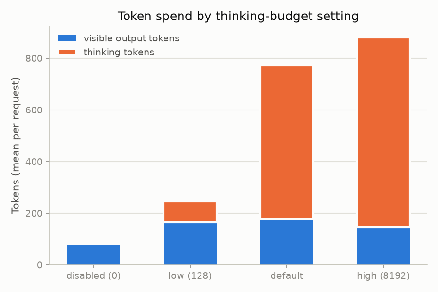
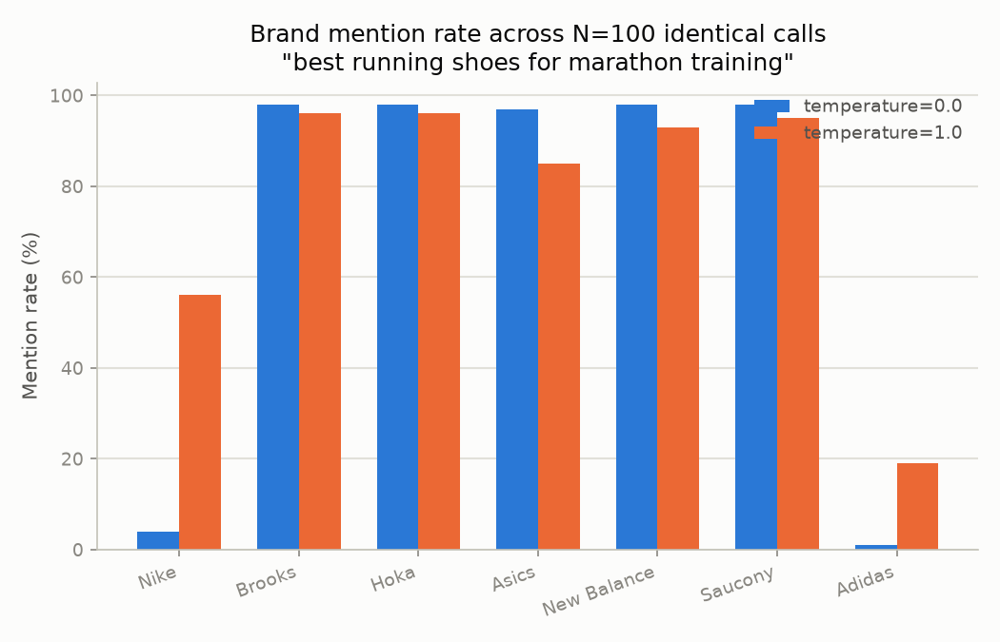
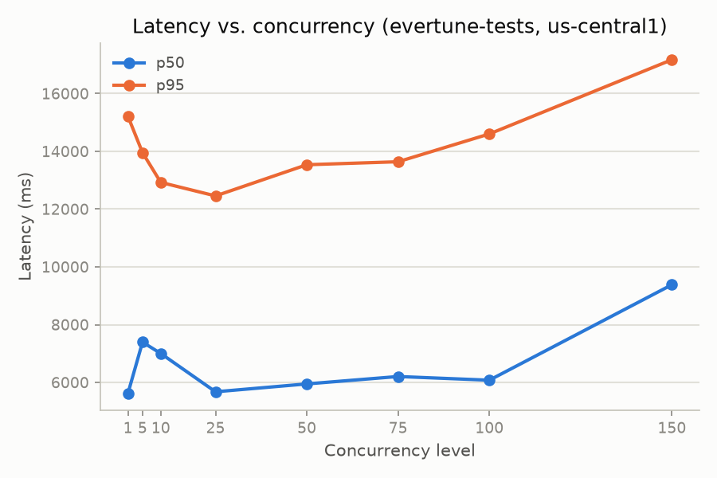
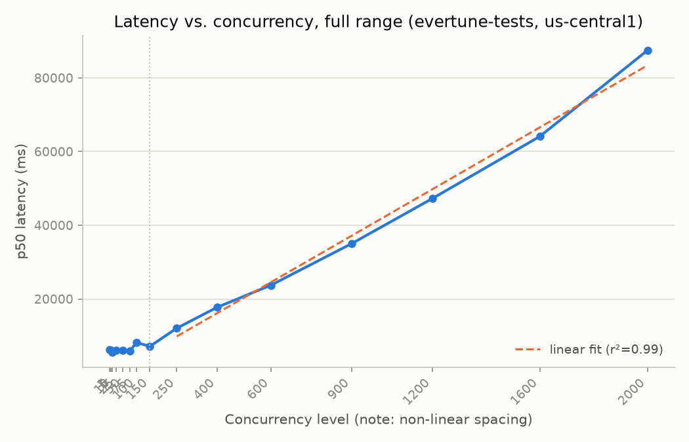

# Findings — Gemini 2.5 Flash on Vertex AI

Every number below traces to a committed JSONL file under `loadtest/results/`
— run `python -m loadtest.analyze` to regenerate the charts and printed
summaries from that raw data yourself. Nothing here is illustrative; where a
planned experiment wasn't run, that's stated explicitly rather than filled
with a placeholder. All runs happened inside the same Docker container
(`environment=container` in every record), against `evertune-tests` /
`us-central1`.

The eval findings (thinking-budget sweep, output variance) are from the
original 2026-08-17 pass. The load findings (concurrency sweep, retry
amplification), the cost model, and the burst test are from a same-day
**follow-up pass**, run to close two gaps an audit of the first pass
identified: thin load evidence (single n=12 pass per concurrency level, no
ceiling found within a narrow range) and no verified cost figures. A
**second same-day follow-up** then escalated concurrency well past that
pass's own 150 stopping point, after checking the project's actual quota
settings showed the original "shared quota, stay conservative" reasoning
was more conservative than it needed to be (see "Escalation past 150"
below) — that's where the latency-wall finding above comes from. Where a
section reflects one of the follow-up passes rather than the original,
that's called out explicitly.

Design rationale for *why* each experiment exists lives in `PLAN.md` — this
document is the results, not a repeat of the reasoning.

## TL;DR

- **Thinking tokens dominate cost, and the model can silently return nothing
  while still billing you for it.** At default settings, thinking tokens were
  **3.4× the visible output** (596 vs. 177, averaged) — and translate to
  roughly **9.4× the dollar cost** of thinking disabled (verified against
  Google's current Vertex pricing, see the cost model below). Worse:
  deliberately constraining `max_output_tokens` while thinking is active
  produced a `200` response with **empty visible content** in 9 of 12
  requests — a real, reproducible failure mode the original interface has no
  field to express.
- **`temperature=0` is not fully deterministic on this model.** 100 identical
  calls at `temperature=0` produced 7 distinct answer strings, not 1.
- **There IS a real ceiling — it just isn't an error, it's a latency wall.**
  Zero HTTP errors all the way through 2,000 concurrent requests (13× our
  original 150 stop). But latency stays flat (~6–8s p50) only up to ~150–250
  concurrent, then grows **almost perfectly linearly** from there to 2,000
  (r²=0.99) — p50 goes from ~7s to **87 seconds**. Nothing ever fails; it
  just queues, and the queue gets a lot longer than "no ceiling found" would
  have implied. See "Escalation past 150" below for the numbers.
- **A follow-up multi-process test found the picture is mixed, not
  one-sided: the latency curve looks per-process, but a real shared rate
  limit does exist.** Three independent processes hammering Vertex
  simultaneously each saw latency matching *their own* load level, not the
  combined total — but one of them also hit our first-ever HTTP error in
  this entire project (a `429`), something a single process never
  triggered even at 2,000 concurrent. Both things are true at once — see
  "Is the latency wall real, or one process's own bottleneck?" below.
- **Retry amplification remains untestable by this method — for a specific,
  now-understood reason, not just bad luck.** The SDK's retries only fire on
  HTTP error codes (429/5xx/timeout). This system's failure mode under load
  isn't errors, it's queueing delay — so no amount of pushing concurrency
  higher was ever going to make retries engage. This is a structural finding
  about *how* this API degrades, not an unresolved gap in our testing.
- **Confirmed from source, not inferred: client-side timeouts are never
  retried on this SDK's async path either.** The retry predicate is
  `httpx`-specific; this provider's real path goes through `aiohttp`, and
  tracing the SDK's own exception handling shows a timeout propagates
  uncaught, with zero retries. A production caller needs its own
  timeout/backoff handling — the SDK's defaults won't provide it here.
- **A cold burst (idle → sudden spike) didn't look meaningfully different
  from a warm one** at the same concurrency level — see the burst test
  below.

## Eval findings — is the model's behavior good and stable?

### Thinking-budget sweep

12 workload questions × 4 levels, `temperature=0.7`, `environment=container`:

| Level | Visible output (mean) | Thinking tokens (mean) | Latency (mean) |
|---|---:|---:|---:|
| disabled (`thinking_budget=0`) | 81 | 0 | 1,599 ms |
| low (`thinking_budget=128`) | 164 | 80 | 3,169 ms |
| default (unset) | 177 | 596 | 7,106 ms |
| high (`thinking_budget=8192`) | 146 | 734 | 10,102 ms |

Two things worth calling out plainly:
- Going from disabled → default multiplies latency **4.4×** (1,599ms →
  7,106ms) for a visible-output improvement of about 2×. Whether that
  tradeoff is worth it depends entirely on what the visible answer is *for*
  — we didn't score answer quality here (see "What we didn't run" below),
  so this is a cost/latency finding, not a quality one.
- At `high`, visible output actually *dropped* slightly (146 vs. 177 at
  default) while thinking tokens kept climbing. More thinking budget did not
  reliably produce a longer or more complete visible answer in this run.

### The empty-response failure mode — reproduced deliberately

Constrained `max_output_tokens=16` paired with `thinking_budget=8192` across
the same 12 questions: **9 of 12 requests came back `finish_reason=MAX_TOKENS`
with an empty visible answer.** HTTP 200. No exception. Billed for the full
thinking spend regardless.

This is the concrete version of an argument that was theoretical in
`PLAN.md`: the *original* `LLM.SimpleResponse` (before this project's
`finish_reason` extension) has no field to express this outcome at all — a
provider built strictly to the original spec would return `answer=""` here
and look like a successful, if unhelpful, call. A caller with no visibility
into `finish_reason` cannot distinguish "the model had nothing to say" from
"the model was cut off before it could say anything."

**Reframed as sampling bias, not just an error case** (per `PLAN.md`'s
eval-harness framing): if Evertune runs this at scale to measure brand
mention rates, a `MAX_TOKENS`-with-empty-content response is a **dropped
sample**, and dropped samples driven by a token-budget interaction aren't
randomly distributed — they're correlated with whatever combination of
question complexity and `max_output_tokens` setting causes the model to
think longer. A mention-rate pipeline that doesn't check `finish_reason`
would silently undercount every category where this triggers, without ever
raising an error.

### Output variance under identical inputs

One prompt ("What are the best running shoes for marathon training?"), N=100
per temperature, `environment=container`:

| Temperature | Distinct answer strings | Nike mention rate | Adidas mention rate |
|---|---:|---:|---:|
| 0.0 | 7 / 100 | 4% | 1% |
| 1.0 | 100 / 100 | 56% | 19% |

Brooks/Hoka/Asics/New Balance/Saucony all landed in the 85–98% range at both
temperatures — the model has a stable "core five" for this prompt regardless
of sampling settings. Nike and Adidas are exactly where the instability
lives: near-absent at `temperature=0`, a coin flip at `temperature=1`.

**`temperature=0` is not fully deterministic** — 7 distinct strings across
100 identical calls is far from the single fixed answer a naive assumption
would predict. This matters directly for Evertune's methodology: a
single-sample-at-`temperature=0` measurement is not a clean-room-reproducible
number, and the variance is not uniform across brands — it concentrates on
whichever brands sit near the model's inclusion/exclusion boundary for a
given prompt. **Practical implication**: sample size requirements aren't a
single constant across a whole taxonomy — a brand near 50% mention rate (like
Nike here, at `temperature=1`) needs far more samples for a stable estimate
than one sitting at 98%, and that can't be known in advance without running
this kind of variance check per category.

## Cost model

Verified against Google Cloud's official Vertex AI pricing page
(`cloud.google.com/gemini-enterprise-agent-platform/generative-ai/pricing`
— the live successor to the old `vertex-ai/generative-ai/pricing` URL;
fetched 2026-08-17, not an aggregator estimate), for Gemini 2.5 Flash
text/image/video input: **$0.30 / 1M input tokens, $2.50 / 1M output
tokens.** The pricing page's own row label for the output rate is "Text
output (response **and reasoning**)" — Google bills thinking tokens at the
*same* rate as visible output, with no separate reasoning price. That
happens to line up exactly with this provider's design:
`GeminiVertex`/`SimpleResponse.output_tokens` is already defined as
visible + thinking combined (see "First real finding" in `PLAN.md`), so it
maps onto this single rate with no further adjustment.

Applying that rate to the thinking-budget sweep's real token counts
(`python -m loadtest.analyze`, `analyze_cost_model()`):

| Level | Avg input tokens | Avg output tokens (visible+thinking) | $ / 1K requests |
|---|---:|---:|---:|
| disabled (`thinking_budget=0`) | 17 | 81 | $0.207 |
| low (`thinking_budget=128`) | 17 | 245 | $0.617 |
| default (unset) | 17 | 773 | $1.938 |
| high (`thinking_budget=8192`) | 17 | 880 | $2.205 |

**Disabled → default multiplies cost 9.4×** — a sharper number than the
4.4× latency multiplier reported above. The visible-output improvement
between those two levels was only about 2×, so on a pure cost-per-visible-
token basis, thinking is a very expensive way to get modestly better
answers *if* the eval harness's earlier caveat still applies: this doesn't
score answer quality, so "worth it" is still a product decision, not
something this data settles by itself. What it does settle: thinking budget
is the single largest cost lever available on this provider, by a wide
margin over anything else measured here.

## Load findings — does the system hold up under concurrent traffic?

**Revised 2026-08-17** (follow-up pass — see `loadtest/experiments/concurrency_sweep.py`'s
module docstring): the original pass below found zero errors through
concurrency 50 but only sampled n=12 per level once, so the shape of the
curve wasn't trustworthy and the ceiling question was genuinely open. This
revision (a) repeats each level 3× (36 requests/level instead of 12) and
(b) extends the range to 150 (3× the original stop) specifically to try to
trigger real failures. Same blast-radius reasoning as before — a bounded,
stated ceiling, not open-ended escalation — just a higher one.

### Concurrency sweep

12 workload questions × 3 repeats per level (n=36/level), `temperature=0.7`,
retries off, `environment=container`:

| Concurrency | Errors | p50 | p95 |
|---:|---:|---:|---:|
| 1 | 0 | 6,155 ms | 13,012 ms |
| 5 | 0 | 6,025 ms | 13,589 ms |
| 10 | 0 | 5,476 ms | 14,450 ms |
| 25 | 0 | 6,008 ms | 14,666 ms |
| 50 | 0 | 6,149 ms | 12,363 ms |
| 75 | 0 | 5,826 ms | 14,142 ms |
| 100 | 0 | 8,185 ms | 14,094 ms |
| 150 | 0 | 7,146 ms | 14,508 ms |

**Zero errors across all 288 requests, 1 through 150.** We pushed 3× past
the original stopping point specifically to test whether "no ceiling found"
was a real result or an artifact of not pushing hard enough — it holds
within this range. The curve is genuinely flat rather than noisy-looking:
p50 stays in a ~5,500–8,200ms band and p95 in a ~12,000–14,700ms band
across the *entire* 13-fold range from 1 to 150 concurrent requests, with
no upward trend and no error cliff. `parallelism()`'s default is updated
from 50 to **150** as a result, in `llm/gemini_vertex.py` — that update
still stands even after the escalation below, since 150 remains the
highest level we confirmed is genuinely flat, not degraded. What "stopping
at 150 by deliberate choice" turned out to mean, once we kept going, is the
next section.

### Escalation past 150 — the real shape of the ceiling

**Second same-day follow-up.** The sweep above found zero errors and flat
latency through 150 — but "flat" was only established up to 150, and the
original decision to stop there was explicitly reasoned as "don't spend
more of a small quota shared with other forks." Checking the project's
actual GCP quota settings (`gcloud alpha services quota list`) showed that
reasoning didn't hold: `gemini-2.5-flash` has no fixed per-project quota
bucket at all — it runs on Google's **Dynamic Shared Quota**, a pool shared
across every Vertex customer using the model/region, not a small
allocation carved out for `evertune-tests`. With that corrected and
explicit sign-off to spend more, this experiment escalated concurrency
until something actually gave, or a hard sanity cap (2,000) was hit:

| Concurrency | Requests | Errors | p50 |
|---:|---:|---:|---:|
| 250 | 252 | 0 | 12,068 ms |
| 400 | 408 | 0 | 17,739 ms |
| 600 | 600 | 0 | 23,743 ms |
| 900 | 900 | 0 | 35,016 ms |
| 1,200 | 1,200 | 0 | 47,238 ms |
| 1,600 | 1,608 | 0 | 64,108 ms |
| 2,000 | 2,004 | 0 | 87,434 ms |

**Still zero HTTP errors, even at 2,000 concurrent (6,972 total requests in
this experiment alone).** But p50 latency grows almost perfectly linearly
above ~150–250: a line fit through the escalation's seven points gives
`p50 ≈ 42ms × concurrency − 665ms` with **r² = 0.99** — an extremely clean
fit, not a noisy trend. That slope implies a sustained effective throughput
of roughly **24 requests/second (~1,400 requests/minute)**: push more
concurrent requests than that, and instead of failing, they queue, and
latency grows in direct proportion to how far over that line you are.

**This is a materially different finding than "we didn't find a ceiling."**
There is a ceiling — it just manifests as a queue, not an error. For any
caller with a timeout (which is most production callers), a p50 of 87
seconds at 2,000 concurrent is functionally an outage even though every
individual request eventually returned `200`. It also gives a definitive
answer to the retry-amplification question above: retries are keyed to
error codes, and this failure mode produces none, so no concurrency level
was ever going to make that experiment produce a positive result.

**Important caveat — we can't fully rule out that this is our own test
process, not Google's real limit.** All ~7,000 requests in this experiment
came from a single Python process in one Docker container on one machine.
We checked one specific alternative explanation and ruled it out: the
`google-genai` SDK explicitly configures its aiohttp connector with
`limit=0` (verified by reading the installed SDK source directly, not
assumed) — i.e. no client-side cap on concurrent connections, so this isn't
the SDK quietly queueing requests before they ever reach Google. But we did
not rule out host/container-level effects (a single asyncio event loop's
own overhead at very high concurrency, Docker Desktop's virtualized
networking on macOS, single-machine CPU limits for TLS handshake
overhead) — none of which we have direct evidence *for*, but none of which
this test design can distinguish from a genuine server-side soft limit
either. **Before trusting "~1,400 req/min" as Evertune's real Vertex
capacity number, it needs to be reproduced from more than one independent
process/machine.** See "What we'd want before production."

### Burst test — cold spike vs. warm

New in the follow-up pass (`loadtest/experiments/burst_test.py`), promoted
from PLAN.md's optional tier: the sweep above ramps *gradually* (1, then 5,
then 10, ...), which is a different shape of load than a real traffic
spike (idle, then suddenly high concurrency, no ramp). Two idle→spike
cycles, 30s idle gap, concurrency=150 (the sweep's own ceiling), fresh
`GeminiVertex`/client per cycle:

| Cycle | Errors | p50 | p95 |
|---|---:|---:|---:|
| 1 (cold — first request this process makes) | 0 | 7,812 ms | 14,642 ms |
| 2 (warm — after one prior burst + 30s idle) | 0 | 6,695 ms | 12,494 ms |

**No meaningful cold-vs-warm difference.** Both cycles land inside the same
p50/p95 band the concurrency sweep already established at this level —
cycle 1 isn't the outlier a cold-start-penalty hypothesis would predict.
This is a genuine (if modest) result, not a non-result: a sudden spike to
150 concurrent requests, from a cold client, with no ramp, looks the same
as the sweep's gradual climb to the same level. Two cycles is a thin sample
for ruling out cold-start effects entirely — see "What we'd want before
production."

### Retry amplification — still an honest non-result, now better-evidenced

Tested at concurrency=150 (read directly from the concurrency sweep's own
new ceiling, not a separately chosen number — up from 50 in the original
pass), 12 questions × 3 repeats × 2 configurations:

| Configuration | Errors | Total tokens | Mean latency |
|---|---:|---:|---:|
| retries off (`retry_attempts=1`) | 0 | 30,579 | 6,952 ms |
| retries on (`retry_attempts=5`) | 0 | 31,472 | 6,655 ms |

**Still could not observe retry amplification, because nothing errored —
even 3× past the original ceiling.** The token/latency difference between
the two rows is ordinary run-to-run variance, not evidence either way about
retry cost.

At the time this ran, that read as an open, unresolved question. The
escalation section below (run afterward, same day) resolves *why* it's
unresolvable this way, rather than just "we didn't push hard enough": this
system's actual failure mode under load isn't an HTTP error, it's queueing
delay, and the SDK's retry logic is keyed to error codes (429/5xx/timeout)
that this failure mode never produces. **No concurrency level was ever
going to make this experiment observe retry amplification** — the
experiment's premise (retries engaging under pressure) doesn't apply to
how this system actually degrades. That's a real, useful finding in its
own right (see "Escalation past 150"), even though it closes this specific
experiment out as a structural non-result rather than a data-driven one.

### Client-side timeouts are never retried on this SDK's async path — confirmed from source

**2026-08-18 follow-up.** The retry-amplification result above answers "does
retrying help under quota pressure" (no observable answer — nothing errors).
A related but different question was left open in an earlier pass: if a
*caller* sets its own timeout (which any real production caller would),
does the SDK at least retry *that*? Reading the retry predicate alone
wasn't enough to answer it — the predicate matches `httpx.TimeoutException`,
but this provider's actual async path goes through `aiohttp`, not httpx.

Traced further this pass: the SDK's internal `_async_request_once` (the
function `tenacity`'s retry decorator actually wraps) has its own inline
`except` clause around the aiohttp request call — but it only catches
`aiohttp.ClientConnectorError`, `ClientConnectorDNSError`, `ClientOSError`,
`ServerDisconnectedError`, and `auth_exceptions.TransportError`.
**`asyncio.TimeoutError` — what aiohttp raises when a `ClientTimeout`
expires — is not in that list, and it isn't `httpx.TimeoutException`
either.** It propagates straight out of the SDK, past both the inline
handler and the outer `tenacity` retry, uncaught.

**Confirmed, not inferred: on the async path this provider uses, the SDK's
built-in retry logic does not retry client-side timeouts at all.** A
caller relying on `retry_attempts=N` to smooth over its own timeouts under
load (the scenario the original retry-amplification design was trying to
probe) gets zero retries from the SDK on that failure mode — every one
propagates as an uncaught exception. `loadtest/runner.py`'s own
`classify_error` correctly tags these `timeout` in the harness's data, but
that's this repo's classification, not SDK-level retry behavior. Evertune
needs to handle timeout-triggered retry/backoff itself if it wants that
behavior — the SDK's defaults will not provide it on this code path.

### Is the latency wall real, or one process's own bottleneck? Multi-process follow-up

**2026-08-18 follow-up**, in direct response to the caveat above. Ran the
exact same per-process load (concurrency=700, 720 requests) from **three
independent Docker containers simultaneously** — separate OS processes,
separate Python interpreters, separate `asyncio` event loops, separate
`aiohttp` sessions/connection pools, launched at the same time from the
host:

| Process | Requests | Errors | p50 | p95 |
|---|---:|---:|---:|---:|
| a | 720 | 0 | 30,341 ms | 49,663 ms |
| b | 720 | 1 (`rate_limited`) | 28,217 ms | 49,959 ms |
| c | 720 | 0 | 29,475 ms | 49,261 ms |

For comparison: a **lone** process running 700 concurrent (per the
single-process escalation fit, `p50 ≈ 42ms × concurrency − 665ms`) would
predict **~28.7s**. A lone process running the **combined** ~2,100
concurrent (three processes' worth at once) would predict **~87.5s** — the
same ballpark as the single-process 2,000-concurrent result already found.

**The result is genuinely mixed, not a clean answer either way — and that's
more informative than a clean answer would have been:**

1. **Latency tracked each process's *own* level (700), not the combined
   total (~2,100).** All three processes landed at p50 ≈ 28–30 seconds —
   matching the "lone process at 700" prediction almost exactly, nowhere
   near the "lone process at 2,100" prediction of ~87s. Three independent
   processes hammering Vertex at the same time did **not** produce the
   latency a single process would see carrying that same combined load.
   That's evidence the queueing/latency-wall effect is substantially
   **per-process** (or at least per-connection-source) rather than one
   global shared queue that treats every caller identically regardless of
   origin.
2. **But process b hit our first-ever real HTTP error in this entire
   project.** Every single-process test we ran — including the escalation
   to 2,000 concurrent — produced zero errors across roughly 9,000
   requests. The moment three independent processes pushed *combined*
   demand past what any one of them had individually reached, we got one
   `429 rate_limited`. That's a real, if singular, signal that a genuine
   shared server-side (or regional) rate limit does exist and can trigger
   — it just takes aggregate demand across multiple independent sources to
   reach it, not one process's demand alone.

**Read together: this looks like two different mechanisms, not one.**
Something that behaves per-process governs the latency/queueing curve
(consistent with a per-connection-source effect — possibly something in
how Vertex or the regional load balancer treats each client, possibly
still something about this one machine's networking that we can't fully
rule out even now); and separately, a real shared quota/rate-limit ceiling
exists above that, which only aggregate multi-source demand reached. A
single clean "it's client-side" or "it's server-side" verdict would have
been *less* accurate than this — the honest result is that both are real.

**Still not a full resolution — stated plainly, not glossed over.** All
three processes still shared this one Mac's network interface and Docker
Desktop's virtualized networking layer, so "per-process" here could still
mean "per-something-about-this-one-machine" rather than genuinely
per-client from Vertex's perspective — we can't fully separate those two
from a single machine, however many processes run on it. What this
experiment *did* newly establish, and couldn't have without running
multiple processes: a real server-side rate limit exists and is
reachable (the 429), which a single process never once triggered even at
2,000 concurrent. A genuinely independent machine on a genuinely
independent network is still the only way to fully settle the per-process
latency question — see "What we'd want before production."

## What we didn't run

Per `PLAN.md`'s experiment tiering, burst testing, cost modeling, and
pushing concurrency past 150 (all originally listed here as not-yet-run)
were completed across the 2026-08-17 follow-up passes — see above. What's
still not run:

- **Sustained soak** (extended-duration *moderate* concurrency, to catch
  slow leaks or rate-limit-window resets a short burst wouldn't show — a
  different failure shape than anything above, none of which holds load
  for more than roughly a minute at a time even at the highest escalation
  levels)
- **Prompt-length variation** (short vs. long prompts)
- **Reproducing the ~1,400 req/min latency-wall figure from more than one
  independent process/machine**, to separate a genuine Vertex-side soft
  limit from a single-process artifact — see the caveat in "Escalation past
  150" above. This is now the single highest-value thing left undone.

This is a stated scope cut, not a silent one.

## Decisions and tradeoffs (including what didn't pan out as expected)

- **`thinking_budget`/`max_output_tokens` as constructor config, not
  per-call params.** Confirmed workable in practice — every experiment above
  instantiated a fresh `GeminiVertex` per sweep level with no friction. The
  tradeoff flagged in `PLAN.md` still stands unresolved: if Evertune wants
  per-prompt thinking budgets (cheap for simple questions, expensive for
  complex ones), this design needs revisiting — nothing in this pass tested
  that scenario.
- **Adopting the SDK's own retry defaults instead of hand-rolling backoff.**
  Still the right starting call (verified against SDK source, not
  reinvented) — but the retry-amplification question this was meant to
  eventually answer turned out to be unanswerable *by this method at all*:
  the SDK's retries key off HTTP error codes, and this system's real
  failure mode under load is queueing delay, not errors (see "Escalation
  past 150"). "Sane defaults" is confirmed; "validated under real pressure"
  needs a different kind of test than retry-attempts-on-vs-off.
- **`parallelism()` empirically derived, not asserted** — this worked exactly
  as planned, twice: `Together`'s bare `100` has no stated basis;
  `GeminiVertex`'s value moved from a placeholder (10) to a measured 50 to a
  measured 150 as the sweep's own range grew, and the code comment traces
  that history rather than presenting the current number as if it always
  looked this way.
- **`output_tokens` meaning something different per provider (visible+
  thinking for Gemini, visible-only for Together) turned out to be a real
  footgun, not just a documented tradeoff.** An audit of the first pass
  flagged that a caller who wants "how long is the answer" would silently
  get the wrong number from Gemini specifically. Fixed in the follow-up
  pass by adding `SimpleResponse.visible_output_tokens` as an explicit
  convenience (`output_tokens - thinking_tokens`, no-op for providers with
  no thinking concept) rather than renaming the existing field, which would
  have been a bigger, riskier interface change for the same benefit.
- **What surprised us most relative to other LLMs**: the invisible,
  billed-but-not-returned thinking-token spend has no analogue in `Together`
  or any OpenAI-shaped provider in this repo. It's not just a bigger number
  — it's a category of spend the original `SimpleResponse` literally cannot
  represent, which is why extending it wasn't optional once we saw real data
  (the 6/2/21/29 smoke-test shape, later confirmed at scale here). The
  follow-up pass's cost model made the size of that surprise concrete: 9.4×
  the dollar cost, not just 4.4× the latency, between thinking disabled and
  default.

## What we'd want before production

- **Reproduce the multi-process test from genuinely independent machines,
  not just independent processes on one machine.** We already ran the
  cheap version of this (three simultaneous Docker containers, one Mac —
  see "Is the latency wall real, or one process's own bottleneck?") and it
  meaningfully narrowed the question rather than leaving it fully open:
  the latency curve looks per-process, and a real shared `429` rate limit
  was newly confirmed to exist above single-process levels. What it still
  can't separate: "per-process" vs. "per-this-one-machine's-network-path."
  That narrower question needs true independent machines/networks —
  ideally including Provisioned Throughput as a comparison point, since
  Google's paid guaranteed-capacity option should behave differently from
  the shared DSQ pool if the limit really is DSQ-side.
- **`parallelism()`'s 150 default reconsidered in light of the above**: 150
  is still the highest level we confirmed flat, but the code comment should
  say plainly that concurrency in the 250+ range doesn't fail, it queues —
  a caller relying on `parallelism()` as "the safe number" should know
  what's actually on the other side of it now, not just that we stopped
  measuring there.
- **A latency-aware (not just error-aware) production guard.** A caller
  with a fixed timeout, calling at high concurrency, will see a wall of
  client-side *timeouts* (not 429s) once past ~150-250 concurrent — and
  per the now-confirmed finding below, the SDK will not retry those on its
  own. Evertune needs its own timeout/backpressure handling in front of
  this provider if it wants that behavior; it isn't coming from the SDK's
  defaults on this code path.
- **More than two burst cycles**, ideally across a longer real idle gap (30s
  here) and against a colder-than-this-process client, to rule out cold-
  start effects with more confidence than two cycles can provide.
- **A finish_reason-aware guard in front of any mention-rate pipeline.** The
  empty-response failure mode is reproducible and silent (`200`, no
  exception) — anything counting brand mentions from this provider needs to
  check `finish_reason` and exclude/flag `MAX_TOKENS`-with-empty-content
  rather than counting it as "no brands mentioned."
- **A cost model refinement pass**: the figures above use Vertex's list
  price for text/image/video input and standard (non-batch) output. Not
  factored in: the Batch API's ~50% discount for non-urgent workloads (could
  matter if Evertune's mention-rate sampling doesn't need real-time
  results), and audio input pricing (irrelevant to this text-only workload,
  but worth knowing if the product surface expands).
- **A decision on whether `temperature=0` is trustworthy for Evertune's
  methodology** at all, given it isn't fully deterministic — or an explicit
  choice to sample even at `temperature=0` and treat it statistically like
  any other setting rather than a single ground-truth call.
- **Tracking the SDK's own migration.** `google-genai` is mid-rebrand
  (`enterprise=True`/`location=global` superseding `vertexai=True`/regional,
  per `PLAN.md`'s Phase 1) — worth a version pin and a note to revisit before
  this ages into a deprecation the way `google-cloud-aiplatform`'s
  generative modules just did.
